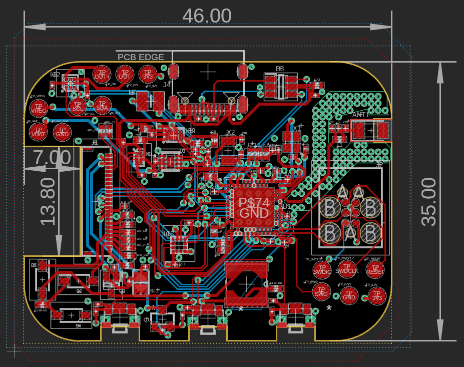
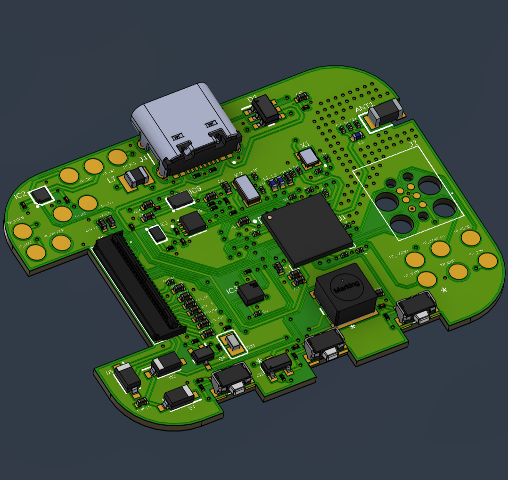
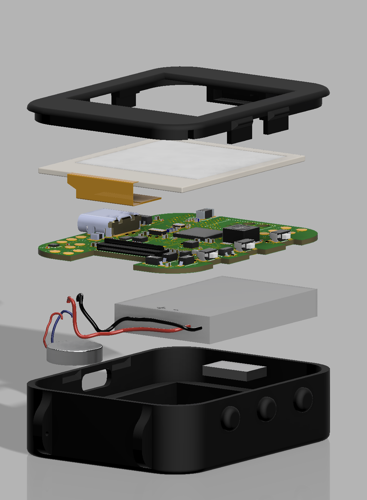
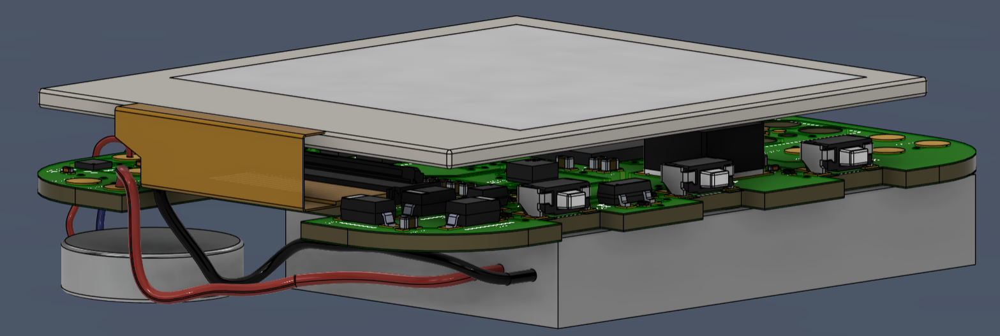

# InkTime TSC

## Block Diagram

---

## Bill of Materials (BOM)

| Name | Component Type | Package | Part Number / Value | Qty | JLCPCB Part Link | Datasheet Link |
| :--- | :--- | :--- | :--- | :--- | :--- | :--- |
| **U1** | MCU | AQFN-74 | NRF52840 | 1 | [View Part](https://jlcpcb.com/parts/componentSearch?searchTxt=NRF52840) | [View Datasheet](https://infocenter.nordicsemi.com/pdf/nRF52840_PS_v1.1.pdf) |
| **IC1** | LiPo Charger | DSBGA-8 | BQ25180YBGR | 1 | [View Part](https://jlcpcb.com/parts/componentSearch?searchTxt=BQ25180YBGR) | [View Datasheet](https://www.ti.com/lit/ds/symlink/bq25180.pdf) |
| **IC2** | Haptic Driver | DSBGA-9 | DRV2605YZFR | 1 | [View Part](https://jlcpcb.com/parts/componentSearch?searchTxt=DRV2605YZFR) | [View Datasheet](https://www.ti.com/lit/ds/symlink/drv2605.pdf) |
| **IC3** | IMU / Accelerometer | LGA-12 | BMA423 | 1 | [View Part](https://jlcpcb.com/parts/componentSearch?searchTxt=BMA423) | [View Datasheet](https://www.bosch-sensortec.com/media/boschsensortec/downloads/datasheets/bst-bma423-ds004.pdf) |
| **IC9** | DC/DC Converter | 15-WL-CSP | RT6160AWSC | 1 | [View Part](https://jlcpcb.com/parts/componentSearch?searchTxt=RT6160AWSC) | [View Datasheet](https://www.richtek.com/assets/product_file/RT6160A/DS6160A-02.pdf) |
| **U3** | Fuel Gauge | TDFN-8 | MAX17048G+T10 | 1 | [View Part](https://jlcpcb.com/parts/componentSearch?searchTxt=MAX17048G%2BT10) | [View Datasheet](https://www.analog.com/media/en/technical-documentation/data-sheets/MAX17048-MAX17049.pdf) |
| **ANT1** | Chip Antenna | ANTC3216 | 2450AT18B100E | 1 | [View Part](https://jlcpcb.com/parts/componentSearch?searchTxt=2450AT18B100E) | [View Datasheet](https://www.johansontechnology.com/datasheets/2450AT18B100/2450AT18B100.pdf) |
| **J1** | FPC Connector | 5034802400 | 503480-2400 | 1 | [View Part](https://jlcpcb.com/parts/componentSearch?searchTxt=503480-2400) | [View Datasheet](https://www.molex.com/pdm_docs/sd/5034802400_sd.pdf) |
| **J2** | Debug Connector | TC2030IDC | TC2030-IDC | 1 | [View Part](https://jlcpcb.com/parts/componentSearch?searchTxt=TC2030-IDC) | [View Datasheet](https://www.tag-connect.com/wp-content/uploads/bsk-pdf-manager/TC2030-IDC_Datasheet_8.pdf) |
| **J4** | USB-C Connector | KH-TYPE-C-16P | KH-TYPE-C-16P | 1 | [View Part](https://jlcpcb.com/parts/componentSearch?searchTxt=KH-TYPE-C-16P) | [View Datasheet](https://www.snapeda.com/parts/KH-TYPE-C-16P/Kinghelm/view-part/) |
| **Q1** | P-Channel MOSFET | SOT23-3 | DMG2305UX-7 | 1 | [View Part](https://jlcpcb.com/parts/componentSearch?searchTxt=DMG2305UX-7) | [View Datasheet](https://www.diodes.com/assets/Datasheets/DMG2305UX.pdf) |
| **Q3** | N-Channel MOSFET | SC-70 / SOT-323 | SI1308EDL-T1-GE3 | 1 | [View Part](https://jlcpcb.com/parts/componentSearch?searchTxt=SI1308EDL-T1-GE3) | [View Datasheet](https://www.vishay.com/docs/71186/si1308ed.pdf) |
| **D2, D4, D5** | Schottky Diode | SOD-123 | MBR0530 | 3 | [View Part](https://jlcpcb.com/parts/componentSearch?searchTxt=MBR0530) | [View Datasheet](https://www.onsemi.com/pdf/datasheet/mbr0520lt1-d.pdf) |
| **D3** | ESD Protection | SOT23-6 | USBLC6-2SC6Y | 1 | [View Part](https://jlcpcb.com/parts/componentSearch?searchTxt=USBLC6-2SC6Y) | [View Datasheet](https://www.st.com/resource/en/datasheet/usblc6-2.pdf) |
| **SW_DN, SW_ENT, SW_UP** | Tactile Button | SMD | EVP-AKE31A | 3 | [View Part](https://jlcpcb.com/parts/componentSearch?searchTxt=EVP-AKE31A) | [View Datasheet](https://industrial.panasonic.com/cdbs/www-data/pdf/ATV0000/ATV0000CE5.pdf) |
| **X1** | Crystal | 2016 | 32MHz | 1 | [View Part](https://jlcpcb.com/parts/componentSearch?searchTxt=32MHz) | N/A |
| **X2** | Crystal | 3215 | 32.768kHz | 1 | [View Part](https://jlcpcb.com/parts/componentSearch?searchTxt=32.768kHz) | N/A |
| **L1** | Inductor | 0402 | 3.9nH | 1 | [View Part](https://jlcpcb.com/parts/componentSearch?searchTxt=3.9nH) | N/A |
| **L2** | Inductor | 0402 | 10uH | 1 | [View Part](https://jlcpcb.com/parts/componentSearch?searchTxt=10uH) | N/A |
| **L3** | Inductor | 0402 | 15nH | 1 | [View Part](https://jlcpcb.com/parts/componentSearch?searchTxt=15nH) | N/A |
| **L5** | Inductor | 4828 | 744043680 | 1 | [View Part](https://jlcpcb.com/parts/componentSearch?searchTxt=744043680) | N/A |
| **L7** | Inductor | INDC2016 | FTC252012SR47MBCA | 1 | [View Part](https://jlcpcb.com/parts/componentSearch?searchTxt=FTC252012SR47MBCA) | N/A |
| **SJ1** | Solder Jumper | SMD | Jumper | 1 | N/A | N/A |
| **R2, R3, R4** | Resistor | 0201 | 0Ω | 3 | [View Part](https://jlcpcb.com/parts/componentSearch?searchTxt=0R+0201) | N/A |
| **R1_EP_DR** | Resistor | 0201 | 0.47Ω | 1 | [View Part](https://jlcpcb.com/parts/componentSearch?searchTxt=0.47R+0201) | N/A |
| **R_TYPE_SEL** | Resistor | 0201 | 2.2Ω | 1 | [View Part](https://jlcpcb.com/parts/componentSearch?searchTxt=2.2R+0201) | N/A |
| **R17, R18** | Resistor | 0201 | 3.3kΩ | 2 | [View Part](https://jlcpcb.com/parts/componentSearch?searchTxt=3.3kR+0201) | N/A |
| **R1_USB, R2_USB** | Resistor | 0201 | 5.1kΩ | 2 | [View Part](https://jlcpcb.com/parts/componentSearch?searchTxt=5.1kR+0201) | N/A |
| **R2_EP_DR, R9, R_PWR_EPD** | Resistor | 0201 | 10kΩ | 3 | [View Part](https://jlcpcb.com/parts/componentSearch?searchTxt=10kR+0201) | N/A |
| **R1, R7, R8** | Resistor | 0201 | 10kΩ | 3 | [View Part](https://jlcpcb.com/parts/componentSearch?searchTxt=10kR+0201) | N/A |
| **C3, C4** | Capacitor | 0201 | 1pF | 2 | [View Part](https://jlcpcb.com/parts/componentSearch?searchTxt=1pF+0201) | N/A |
| **C1, C2, C17, C18** | Capacitor | 0201 | 12pF | 4 | [View Part](https://jlcpcb.com/parts/componentSearch?searchTxt=12pF+0201) | N/A |
| **C11** | Capacitor | 0201 | 100pF | 1 | [View Part](https://jlcpcb.com/parts/componentSearch?searchTxt=100pF+0201) | N/A |
| **C9** | Capacitor | 0201 | 820pF | 1 | [View Part](https://jlcpcb.com/parts/componentSearch?searchTxt=820pF+0201) | N/A |
| **C16** | Capacitor | 0201 | 47nF | 1 | [View Part](https://jlcpcb.com/parts/componentSearch?searchTxt=47nF+0201) | N/A |
| **C5, C7, C8, C12, C19** | Capacitor | 0201 | 100nF | 5 | [View Part](https://jlcpcb.com/parts/componentSearch?searchTxt=100nF+0201) | N/A |
| **C23, C27, C34, C42** | Capacitor | 0201 | GRM011R60J152KE01L | 4 | [View Part](https://jlcpcb.com/parts/componentSearch?searchTxt=GRM011R60J152KE01L) | N/A |
| **EPD_C5** | Capacitor | 0201 | 0.1uF/50V | 1 | [View Part](https://jlcpcb.com/parts/componentSearch?searchTxt=0.1uF+50V+0201) | N/A |
| **C29, C30, C31, C32, C37, C38**| Capacitor | 0201 | GRM011R60J152KE01L | 6 | [View Part](https://jlcpcb.com/parts/componentSearch?searchTxt=GRM011R60J152KE01L) | N/A |
| **C15** | Capacitor | 0402 | 1.0uF | 1 | [View Part](https://jlcpcb.com/parts/componentSearch?searchTxt=1.0uF+0402) | N/A |
| **C43** | Capacitor | 0402 | 4.7uF | 1 | [View Part](https://jlcpcb.com/parts/componentSearch?searchTxt=4.7uF+0402) | N/A |
| **C6, C14, C20, C21** | Capacitor | 0402 | 4.7uF | 4 | [View Part](https://jlcpcb.com/parts/componentSearch?searchTxt=4.7uF+0402) | N/A |
| **C2-EP-DR** | Capacitor | 0402 | 4.7uF/25V | 1 | [View Part](https://jlcpcb.com/parts/componentSearch?searchTxt=4.7uF+25V+0402) | N/A |
| **C1-EP-DR, C24, C39** | Capacitor | 0402 | 10uF | 3 | [View Part](https://jlcpcb.com/parts/componentSearch?searchTxt=10uF+0402) | N/A |
| **C25, C33** | Capacitor | 0402 | 22uF | 2 | [View Part](https://jlcpcb.com/parts/componentSearch?searchTxt=22uF+0402) | N/A |
| **EPD_C1, EPD_C2, EPD_C6–EPD_C12**| Capacitor | 0402 | 1uF/50V | 9 | [View Part](https://jlcpcb.com/parts/componentSearch?searchTxt=1uF+50V+0402) | N/A |
| **C10, C13, C22** | Not Connected | 0201 | DNP | 3 | N/A | N/A |
| **TP_3.3V, TP_3V3, TP_BAT_GND, TP_GND, TP_ON, TP_OP, TP_RESET, TP_SCL, TP_SDA, TP_SWDCLK, TP_SWDIO, TP_SWO, TP_VBAT, TP_VREG** | Test Pad | TP20R | Test Pad | 14 | N/A | N/A |

---

## Hardware Functionality

This section describes the main hardware subsystems of the InkTime smartwatch, focusing on component choices, overall architecture, and how the design is optimized for low power consumption.

---

### 1. Core Processing & RF

**Microcontroller (MCU):**  
The system is built around the **Nordic nRF52840 (ARM Cortex-M4F)**. It was chosen mainly because it already includes Bluetooth Low Energy (BLE 5.0) and USB support, so no extra external communication chips are needed.

**Clocking System:**  
A dual-crystal setup is used:
- 32 MHz crystal for normal processing and wireless communication  
- 32.768 kHz crystal for the real-time clock (RTC) during low-power sleep modes  

This allows the system to keep accurate time while consuming very little energy when idle.

**Wireless Connectivity:**  
A small 2.4 GHz chip antenna is placed at the edge of the PCB. A matching network is used to improve RF performance and ensure stable BLE communication with a phone or other devices.

---

### 2. Power Management Architecture

The power system is designed to keep energy usage as low as possible while maintaining stable operation.

**Charging & Input:**  
Power is supplied through a USB-C connector, with ESD protection for safety. A **BQ25180 power management IC** handles LiPo charging and automatically switches between USB power and battery operation.

**Voltage Regulation:**  
Since battery voltage changes during discharge, an **RT6160 converter** is used to generate a stable 3.3V rail. This ensures the system works reliably across the entire battery range without brownouts.

**Battery Monitoring:**  
A **MAX17048 fuel gauge** estimates battery level. It reads voltage directly, avoiding the need for a current-sense resistor, which helps reduce power loss and saves space.

---

### 3. Display Subsystem

**E-Paper Panel:**  
The visual output is handled by an e-paper display, selected because it offers very good readability in sunlight and keeps the image without consuming power.

**Power Control:**  
The display requires higher voltages for operation, but it is only powered during refresh cycles. The rest of the time, the MCU completely switches it off using a MOSFET-based power gating circuit. This significantly reduces idle power consumption.

---

### 4. Sensing & User Interaction

**Motion Tracking:**  
A BMA42x IMU is used to detect motion, steps, and general activity. Instead of being read continuously, it can generate interrupt signals that wake the MCU only when movement is detected (for example, wrist movement).

**Haptic Feedback:**  
A DRV2605 haptic driver controls a vibration motor. Rather than generating signals manually, the MCU only triggers predefined vibration patterns stored in the driver.

**Tactile Inputs:**  
Three physical buttons are used for user interaction. They include hardware debounce filtering so that inputs remain stable without needing constant software correction.

---

### 5. Communication Buses

To keep the PCB simple and organized, communication is divided based on speed requirements:

**Shared I2C Bus:**  
Used for low-speed peripherals such as the IMU, fuel gauge, charger IC, and haptic driver. This reduces the number of required MCU pins and keeps routing simple.

**Dedicated SPI Bus:**  
Used only for the e-paper display, since it needs higher data throughput during screen updates. Additional control signals (reset, data/command, busy) are used to manage the display operation.

**Debug Interface:**  
Firmware programming and debugging are handled through a SWD interface, which provides full access without requiring a large permanent header on the PCB.

---

### 6. Power Consumption (Estimation)

The system is mainly optimized for low-power operation, with most components active only for short periods and the MCU spending most of the time in sleep mode.

Typical currents:
- nRF52840 active: ~10–15 mA  
- E-paper refresh (peak): ~20–40 mA (short bursts)  
- IMU: ~0.1 mA  
- Haptic motor: ~50–70 mA (very short pulses)  
- Deep sleep: ~2–5 µA  

With a ~180 mAh LiPo battery and a mostly idle usage pattern (sleep + occasional updates), the estimated battery life is around **5 days**.

---
## nRF52840 Pin Mapping
| Pin | Component / Block | Purpose |
|:--- |:--- |:--- |
| **---** | **Power & Regulation** | **---** |
| **VDD** | MCU Power | Main 3.3V supply for the microcontroller. |
| **VDDH** | MCU Power | High-voltage supply input. |
| **VSS / VSS_PA / VSS_PAD** | Ground | Ground connections for MCU and RF stages. |
| **DEC[1..6] / DEC3V3** | Internal Regulation | Decoupling pins for internal regulators and 3.3V rail stability. |
| **DCC** | DC/DC | Support pins for the internal DC/DC converter. |
| **---** | **Clock & RF** | **---** |
| **XC1 / XC2** | System Clock | 32 MHz crystal oscillator for main operation. |
| **XL1 / XL2** | System Clock | 32.768 kHz crystal for RTC and low-power modes. |
| **ANT** | Antenna | Connection to the 2.4 GHz RF output. |
| **---** | **E-Paper Display (SPI)** | **---** |
| **P0.02** | E-Paper Display | SPI clock (SCK) for display communication. |
| **P0.03** | E-Paper Display | SPI data line (MOSI) for sending pixel data. |
| **P0.05** | E-Paper Display | Chip select to enable the display on the SPI bus. |
| **P0.15** | E-Paper Display | Selects between command and data mode. |
| **P0.16** | E-Paper Display | Hardware reset for the display controller. |
| **P0.17** | E-Paper Display | Busy signal used to synchronize display updates. |
| **P1.01** | E-Paper Display | Controls power gating for the display. |
| **---** | **I2C Bus** | **---** |
| **P0.06** | IMU, Fuel Gauge, Charger, Haptic Driver | Shared I2C data line (SDA) for all peripherals. |
| **P0.07** | IMU, Fuel Gauge, Charger, Haptic Driver | Shared I2C clock line (SCL). |
| **---** | **Sensors & Power ICs** | **---** |
| **P0.08** | IMU | Primary interrupt for motion and wake-up events. |
| **P1.08** | IMU | Secondary interrupt for advanced events. |
| **P0.11** | LiPo Charger | Interrupt line for charge status and fault detection. |
| **P0.10** | Fuel Gauge | Alert signal for low battery or voltage thresholds. |
| **---** | **User Interface** | **---** |
| **P0.12** | Haptic Driver | Enable signal for the vibration motor driver. |
| **P0.13** | Button | User input |
| **P0.14** | Button | User input |
| **P1.02** | Button | User input |
| **---** | **System & SWD** | **---** |
| **P0.18** | System | Global reset line for the microcontroller. |
| **SWDIO** | SWD Interface | Data line for programming and debugging. |
| **SWDCLK** | SWD Interface | Clock line for the debugging interface. |
| **P1.00** | SWD Interface | SWO trace output for advanced debugging. |
| **---** | **USB Interface** | **---** |
| **D+ / D-** | USB Interface | Differential data lines for USB communication. |
| **VBUS** | USB Interface | Used to detect USB connection. |
---
*Note: All other nRF52840 pins not listed in this table are unused and reserved for future hardware revisions.*

## 5. Design

### PCB Renderings

### Component Placement in Case

